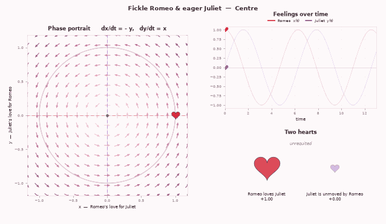
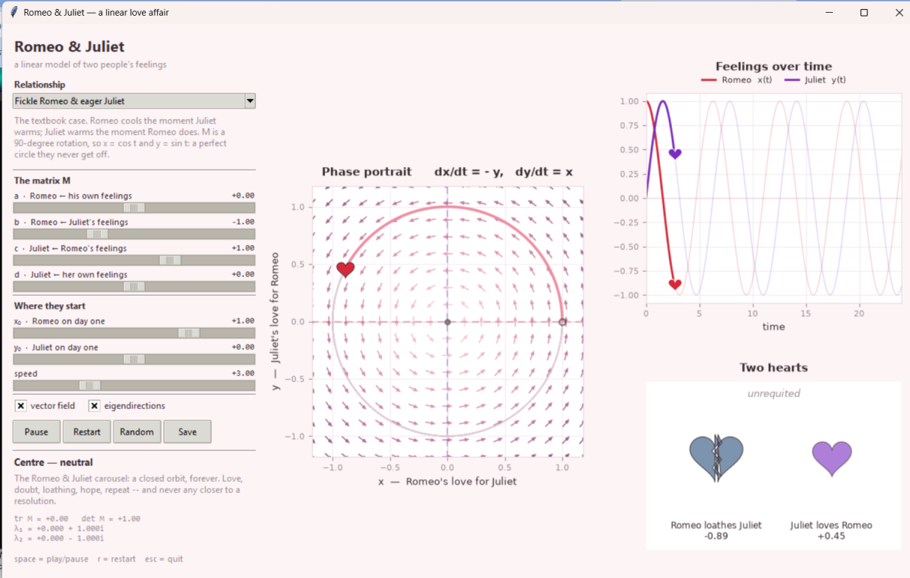
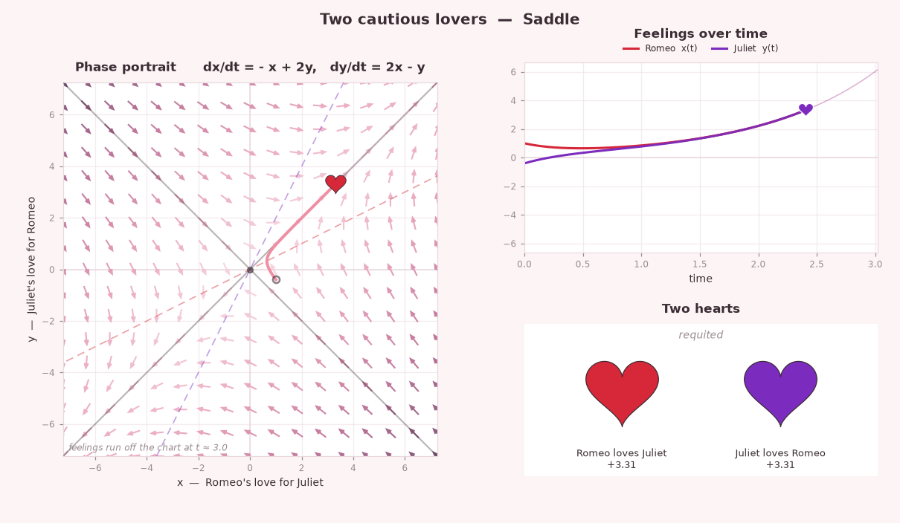
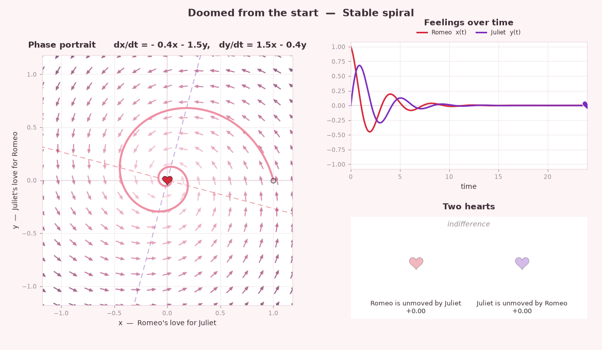

# Romeo & Juliet — a linear love affair

Two people, two numbers, one matrix. This is the classic Romeo & Juliet model of
love as a system of linear differential equations, turned into a desktop app you
can play with: drag the four entries of **M**, watch the orbit change, and see
where the couple ends up.



## The idea

Let `x(t)` be Romeo's love for Juliet and `y(t)` be Juliet's love for Romeo.
Negative means loathing, zero means indifference. Each person's feelings change
at a rate that depends on both:

```
dx/dt = a·x + b·y
dy/dt = c·x + d·y
```

which is a matrix differential equation for the vector of feelings:

```
d ⎡x(t)⎤   ⎡a  b⎤ ⎡x⎤
──⎢    ⎥ = ⎢    ⎥ ⎢ ⎥            v'(t) = M v(t)
dt⎣y(t)⎦   ⎣c  d⎦ ⎣y⎦
```

The textbook case is `a = 0, b = -1, c = 1, d = 0`: Romeo cools off the moment
Juliet warms up the moment Romeo does. Then **M** is a 90°
rotation matrix, the solution starting from `(1, 0)` is exactly

```
x(t) = cos t        y(t) = sin t
```

and the two of them go round and round forever, never both in love at the same
time for long. The eigenvalues are `±i`, a pure rotation, no growth, no decay.

Change the four numbers, and you change the ending. The eigenvalues of **M** decide
everything: real and positive is runaway passion, real and opposite signs is a
knife-edge saddle, complex with a negative real part is a spiral into
indifference.

## Install and run

```bash
git clone https://github.com/YOUR-GITHUB-USERNAME/romeo-juliet-love-dynamics.git
cd romeo-juliet-love-dynamics
pip install -e .
romeo-juliet
```

Or without installing anything but the two dependencies:

```bash
pip install numpy matplotlib
python -m romeo_juliet
```

Python 3.10+, and Tkinter (bundled with python.org and Windows installers; on
Debian/Ubuntu it is `sudo apt install python3-tk`).

## What you get



* a **phase portrait** with the vector field of `v' = M v`, the nullclines, the
  real eigendirections, and a heart riding the orbit;
* the **time series** of both feelings, each with its own heart sliding along it;
* **two hearts** that swell with how strongly each person feels and crack open
  when the feeling turns to loathing;
* sliders for `a, b, c, d` and for how they each feel on day one;
* a live verdict centre, saddle, spiral, node with the trace, the
  determinant and both eigenvalues;
* eight ready-made relationships, a **Random** button, and **Save** for a PNG.

Keyboard: `space` play/pause, `r` restart, `esc` quit.

## The built-in relationships

| Relationship | M | Ending |
| --- | --- | --- |
| Fickle Romeo & eager Juliet | `[[0, -1], [1, 0]]` | Centre —> the endless carousel |
| Two cautious lovers | `[[-1, 2], [2, -1]]` | Saddle —> love fest or war, decided on day one |
| Fire and ice | `[[1, -1], [1, -1]]` | Line of fixed points |
| Peas in a pod | `[[1, 1], [1, 1]]` | Line of fixed points —> unbounded |
| Doomed from the start | `[[-0.4, -1.5], [1.5, -0.4]]` | Stable spiral —> it fizzles out |
| Escalating rollercoaster | `[[0.25, -1.5], [1.5, 0.25]]` | Unstable spiral —> louder every lap |
| Romeo the robot | `[[0, 0], [1, 0]]` | Line of fixed points |
| Out of touch with their own feelings | `[[0, 1], [1, 0]]` | Saddle |

```bash
romeo-juliet list                                  # the table above, from the code
romeo-juliet --preset "Two cautious lovers"        # open one of them
romeo-juliet --params 0 -1 1 0 --start 1 0         # or your own
```

<p align="center">
  
  
</p>

## Render without a window

```bash
romeo-juliet render --preset "Doomed from the start" -o doomed.png
romeo-juliet render --params 0 -1 1 0 --gif orbit.gif --frames 64 --fps 14
```

The GIF needs Pillow (`pip install pillow`).

## Use it as a library

```python
from romeo_juliet import LoveAffair

affair = LoveAffair(a=0, b=-1, c=1, d=0)   # he is fickle, she is eager

affair.classify().name        # 'Centre'
affair.eigenvalues()          # array([0.+1.j, 0.-1.j])
affair.equations()            # ('dx/dt = - y', 'dy/dt = x')
affair.solve([1.0, 0.0], [0, 3.14159])     # -> [[1, 0], [-1, 0]]
```

## How it works

The system is linear, so it doesn't need a numerical integrator. For a
2×2 matrix, Cayley–Hamilton collapses the series for `exp(Mt)` into three cases —
distinct real eigenvalues, a complex pair, or a repeated one — and
`romeo_juliet/model.py` uses that closed form. Every trajectory you see is exact
to machine precision, which is why the classic orbit closes into a perfect
circle instead of slowly drifting the way a Runge–Kutta orbit would. (`rk4_trajectory`
is kept around anyway, and the test suite checks the two against each other.)

The fate of the affair is read off the trace and determinant of **M**:

| | `det M < 0` | `det M > 0`, `tr² < 4 det` | `det M > 0`, `tr² > 4 det` |
| --- | --- | --- | --- |
| `tr M < 0` | saddle | stable spiral | stable node |
| `tr M = 0` | saddle | **centre** | — |
| `tr M > 0` | saddle | unstable spiral | unstable node |

## Tests

```bash
pip install -e ".[dev]"
python -m pytest -q
```

28 tests: the closed-form solution against Runge–Kutta, the propagator's group
property `exp(M(s+t)) = exp(Ms)·exp(Mt)`, the classification of every case, and
Tk smoke tests that build the window and drive it (skipped automatically on a
headless machine).

## Credits

The model is **Steven Strogatz's**. He introduced love affairs as a way into
linear systems in:

* Strogatz, S. H. (1988). *Love affairs and differential equations.*
  Mathematics Magazine, **61**(1), 35.
* Strogatz, S. H. *Nonlinear Dynamics and Chaos*, §5.3 and its exercises — where
  the fickle/eager pair and the whole taxonomy of endings come from.

The framing of this repository: Juliet's love rising as Romeo's attention
falls, `M` as a 90° rotation with `[1 0]` for Romeo and `[0 -1]` for Juliet, the idea
follows a write-up by Instagram love story.

> A note on the convention used here: with `dx/dt = -y` and `dy/dt = x`, it is
> Romeo who cools when Juliet warms, and Juliet who warms when Romeo does. Swap
> the signs and you get the mirror-image story; it is the same carousel, turning
> the other way.

## License

MIT — see [LICENSE](LICENSE).
